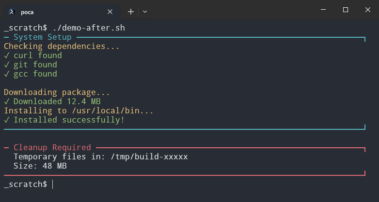
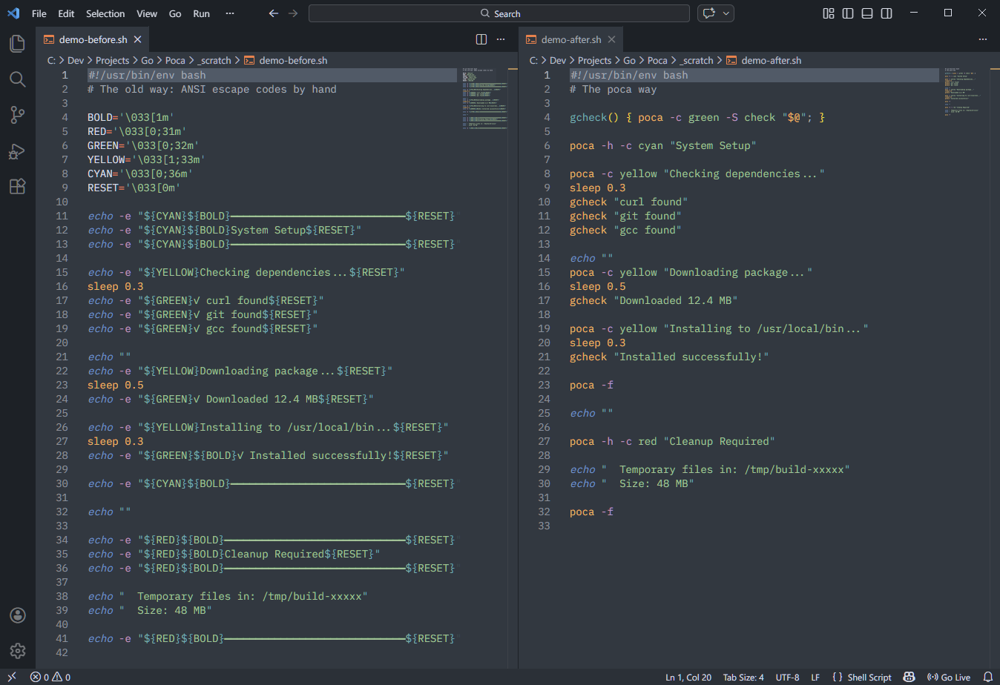

# poca

Colored terminal output, sections, and symbols for shell scripts. One binary, no runtime, no manual escape codes.



## The problem

Printing colored, structured output in bash means memorizing escape codes and managing resets by hand:

```bash
BOLD='\033[1m'
RED='\033[0;31m'
GREEN='\033[0;32m'
CYAN='\033[0;36m'
RESET='\033[0m'

echo -e "${CYAN}━━━━━━━━━━━━━━━━━━━━━━━━━━━━━━━━━━━━${RESET}"
echo -e "${CYAN}${BOLD}System Setup${RESET}"
echo -e "${CYAN}${BOLD}━━━━━━━━━━━━━━━━━━━━━━━━━━━━━━━━━━━━━${RESET}"
echo -e "${GREEN}✓ Dependencies installed${RESET}"
echo -e "━━━━━━━━━━━━━━━━━━━━━━━━━━━━━━━━━━━━━"
```

The alternative is pulling in Python, Node, or another runtime just to get an ANSI formatted lines of text. Or god forbid you try to make wrapper functions in BASH that accept arguments.

## The fix

```bash
poca -h -c cyan "System Setup"
poca -c green -S check "Dependencies installed"
poca -f
```

Poca is a single compiled binary. Drop it in your PATH or your dotfiles, or check it into your repo and use it anywhere - install scripts, deployment pipelines, bash profiles, CI output.

## Install

Download a binary from the [releases page](https://github.com/kjerk/poca/releases).

Or build from source:

```sh
scripts/build.sh       # Linux/macOS → ./build/poca
scripts\build.bat      # Windows → .\build\poca.exe
```

## Quick reference

| Short | Long | Description |
|-------|------|-------------|
| `-h` | `--header` | Print a section header |
| `-f` | `--footer` | Print a section footer |
| `-c` | `--color` | Text color |
| `-s` | `--style` | Text style (repeatable) |
| `-S` | `--symbol` | Prepend a symbol |
| `-p` | `--preset` | Visual preset |
| `-w` | `--width` | Override terminal width |

**Colors:** black, red, green, yellow, blue, magenta, cyan, white, dark-gray, light-red, light-green, light-yellow, light-blue, light-magenta, light-cyan, light-white

**Styles:** bold, dim, italic, underline, blink, reverse, hidden, strikethrough

**Symbols:** check (✓), cross (✗), arrow (→), warning (⚠), info (ℹ)

**Presets:** default, bold, double, simple, boxed, gradient

Color and style names are case-insensitive and ignore special characters - `dark-gray`, `DarkGray`, and `dark_gray` all work. Full list in [`lookup.go`](cmd/poca/lookup.go).

## Environment

Set `POCA_PRESET` to change the default preset without passing `-p` every time:

```sh
export POCA_PRESET=bold
```

## Presets

```
default    ─ Title ─────────────────────┐
           ...
           ─────────────────────────────┘

bold       ━ Title ━━━━━━━━━━━━━━━━━━━━━┓
           ...
           ━━━━━━━━━━━━━━━━━━━━━━━━━━━━━┛

double     ═ Title ═════════════════════╗
           ...
           ═════════════════════════════╝

simple     ═ Title ══════════════════════
           ...
           ══════════════════════════════

boxed      ─────────────────────────────╮
           ─ Title ─────────────────────┤
           ...
           ─────────────────────────────╯

gradient   ░░░▒▒▒▓▓▓███━━━━━━━━━███▓▓▓▒▒▒░░░
           ░░░▒▒▒▓▓▓███  Title  ███▓▓▓▒▒▒░░░
           ...
           ░░░▒▒▒▓▓▓███━━━━━━━━━███▓▓▓▒▒▒░░░
```

### Why?



Born out of maintaining personal dotfiles and installers. Even if you want zero dependencies and only use bash, the moment you want colored output with flexible arguments, you're writing a mess of escape codes, argument parsing, and wrapper functions that are painful to maintain and painful to read.

Poca turns that into one small, reliable binary. Check it into a repo, fetch it in a script, drop it in your dotfiles. Wrap it in short aliases and you've got a clean vocabulary for script output:

```bash
# Use it directly
poca -h -c cyan "System Setup"
# Or make it dance
gcheck() { poca -c green -S check "$@"; }
warn()   { poca -c yellow -S warning "$@"; }
fail()   { poca -c red -S cross "$@"; }
section(){ poca -h -c cyan "$@"; }
endsec() { poca -f; }
```

## License
MIT
